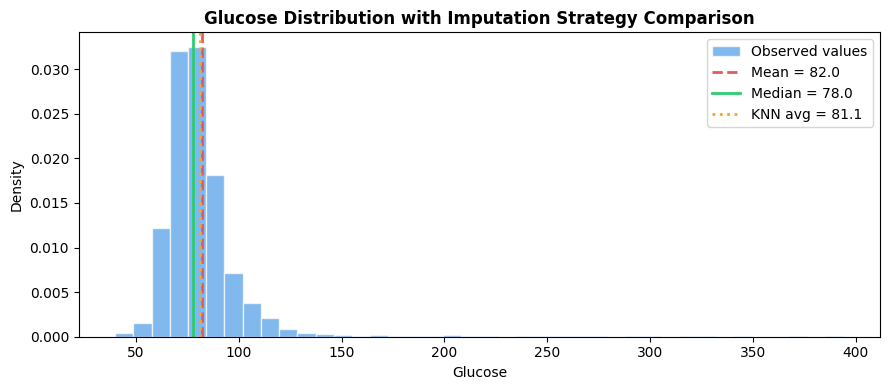
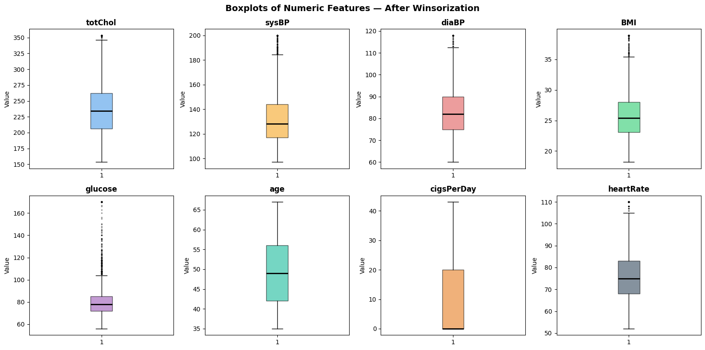
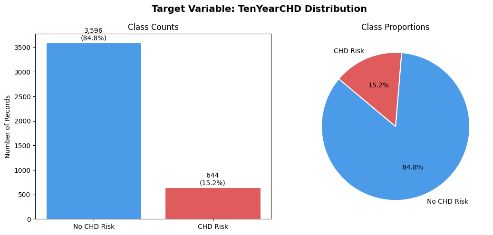
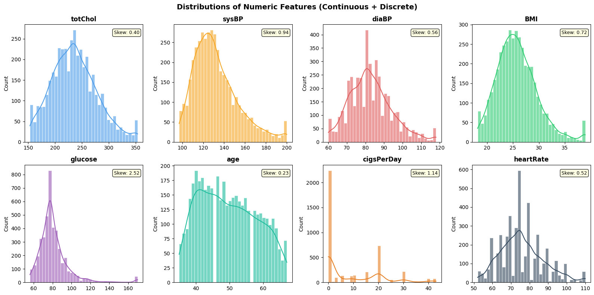
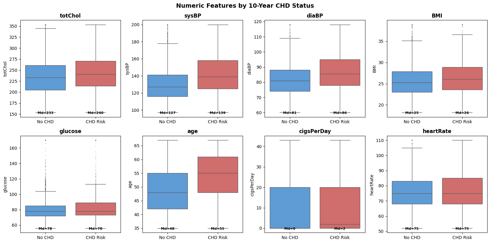
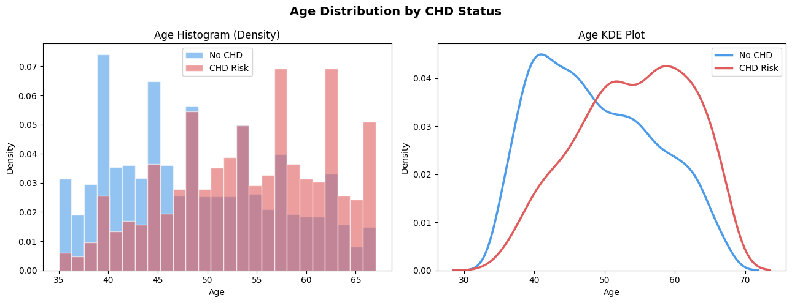

# Laxmi Kanth Oruganti
## MSCS-634 : Advanced Big Data and Data Mining
## Project Deliverable 1: Data Collection, Cleaning, and Exploration

**University:** University of the Cumberlands  
**Dataset:** Framingham Heart Study  
**Source:** [Kaggle – aasheesh200/framingham-heart-study-dataset](https://www.kaggle.com/datasets/aasheesh200/framingham-heart-study-dataset)

---

## Dataset Summary

For this project, I selected the **Framingham Heart Study** dataset from Kaggle. It originates from one of the longest-running cardiovascular studies in the United States, conducted by the National Heart, Lung, and Blood Institute (NHLBI). The dataset contains clinical measurements, lifestyle habits, and medical history collected to study 10-year coronary heart disease (CHD) risk.

I chose this dataset because it satisfies all project requirements in a single file — it has real missing values across 7 columns, a binary classification target, multiple continuous features suitable for regression, a rich numeric space for clustering, and enough binary indicators for association rule mining. No secondary dataset was needed.

| Property | Details |
|---|---|
| **Records** | 4,240 patient observations |
| **Attributes** | 16 (15 input features + 1 binary target) |
| **Domain** | Cardiovascular health / Coronary Heart Disease (CHD) risk |
| **Target variable** | `TenYearCHD` — binary (0 = no CHD risk, 1 = CHD risk within 10 years) |
| **Missing values** | 7 columns: `glucose`, `education`, `BPMeds`, `totChol`, `cigsPerDay`, `BMI`, `heartRate` |
| **Class distribution** | 84.8% no CHD risk (3,596) vs 15.2% CHD risk (644) |
| **License** | Public domain / educational use via Kaggle |

### Feature Reference Table

| Feature | Type | Description |
|---|---|---|
| `male` | Binary | Sex (1 = male, 0 = female) |
| `age` | Discrete (years) | Patient age in years |
| `education` | Ordinal (1–4) | 1 = less than high school, 2 = HS diploma, 3 = some college, 4 = college+ |
| `currentSmoker` | Binary | Currently smokes (1 = yes) |
| `cigsPerDay` | Discrete count | Average cigarettes per day (0–70) |
| `BPMeds` | Binary | On blood pressure medication (1 = yes) |
| `prevalentStroke` | Binary | History of stroke (1 = yes) |
| `prevalentHyp` | Binary | Hypertension present (1 = yes) |
| `diabetes` | Binary | Diagnosed diabetic (1 = yes) |
| `totChol` | Continuous | Total cholesterol (mg/dL) |
| `sysBP` | Continuous | Systolic blood pressure (mm Hg) |
| `diaBP` | Continuous | Diastolic blood pressure (mm Hg) |
| `BMI` | Continuous | Body mass index (kg/m²) |
| `heartRate` | Discrete count | Resting heart rate (bpm) |
| `glucose` | Continuous | Fasting blood glucose (mg/dL) |
| `TenYearCHD` | Binary | **Target** — 10-year CHD risk (1 = at risk, 0 = not at risk) |


---

## Data Cleaning Steps

### Step 1 — Missing Value Analysis

Running `df.isnull().sum()` on the raw dataset revealed 7 columns with missing values. Results sorted by missingness percentage:

| Column | Missing Count | Missing % | Imputation Applied | Reason |
|---|---|---|---|---|
| `glucose` | 388 | 9.15% | Median (78.0) | Right-skewed (skew=2.52); median robust to extreme values |
| `education` | 105 | 2.48% | Median → Mode (1.0) | Ordinal categorical — mode gives most common observed category |
| `BPMeds` | 53 | 1.25% | Median → Mode (0.0) | Binary flag — only two valid values; mode is appropriate |
| `totChol` | 50 | 1.18% | Median (234.0) | Slight right skew; median preferred over mean |
| `cigsPerDay` | 29 | 0.68% | Median (0.0) | Discrete count; most patients are non-smokers; heavy right skew |
| `BMI` | 19 | 0.45% | Median (25.4) | Right-skewed clinical measurement |
| `heartRate` | 1 | 0.02% | Median (75.0) | Single missing value |

### Step 2 — Imputation Strategy Comparison

Mean (82.0), median (78.0), and KNN avg (81.1) were compared on `glucose` — the column with the highest missingness at 9.15%. The chart below shows all three strategies overlaid on the observed glucose distribution.



Median was selected because `glucose` is heavily right-skewed (skew=2.52). The mean is pulled upward by patients with very high diabetic readings, making it unrepresentative of a typical patient. The same logic applies to all numeric columns — median imputation was applied throughout. For `education` (ordinal) and `BPMeds` (binary), mode imputation was applied in a second pass since mean/median have no meaningful interpretation for categorical columns.

### Step 3 — Duplicate Detection

`df_clean_data.duplicated()` was applied across all 16 columns simultaneously. **No duplicate rows were found.** This step is included as a standard safeguard — duplicates cause data leakage when the same record appears in both training and test splits, artificially inflating model evaluation metrics.

### Step 4 — Value Range Validation

Every feature was validated against clinically grounded bounds sourced from published medical guidelines. All 16 features passed — no physiologically impossible values were detected.

| Feature | Bounds | Source |
|---|---|---|
| `sysBP` / `diaBP` | (80–295) / (40–150) mm Hg | JNC 8 / ACC-AHA (James et al., 2014) |
| `totChol` | (100–600) mg/dL | AHA Cholesterol Guidelines |
| `BMI` | (10–60) kg/m² | WHO BMI Classification |
| `glucose` | (40–400) mg/dL | ADA Diagnosis Standards |
| `heartRate` | (40–150) bpm | AHA Tachycardia Reference |
| `age` | (20–80) years | Framingham Study enrollment/follow-up range |
| `education`, binary flags | (1–4), (0–1) | Framingham Study Codebook |

### Step 5 — Outlier Detection and Treatment (Winsorization)

IQR method (Q1 − 1.5×IQR, Q3 + 1.5×IQR) was applied to all 8 numeric features to detect outliers. Winsorization (1st–99th percentile capping via `pandas.Series.clip()`) was then applied to treat them — preserving all 4,240 records while bounding extreme values to defensible limits (Tukey, 1977).

The boxplots below confirm the treatment was applied correctly — whiskers are bounded and consistent with clinical expectations.



`cigsPerDay` shows a large IQR box starting at 0 (most patients are non-smokers) with a long upper whisker reflecting the heavy smoking tail. `sysBP` and `diaBP` show clean symmetric distributions after capping. `glucose` still shows a few remaining fliers within the accepted clinical range (40–400 mg/dL).

---

## Exploratory Data Analysis (EDA)

### Target Variable Distribution

The chart below shows the class balance of the target variable `TenYearCHD`.



84.8% of patients (3,596) have no CHD risk while only 15.2% (644) are flagged as at-risk. This significant class imbalance means a naive classifier that always predicts "no risk" would still achieve 84.8% accuracy. In Deliverable 3, stratified train/test splits and SMOTE oversampling will be used to address this.

---

### Numeric Feature Distributions

The histograms and KDE plots below show the distribution shape and skewness of all 8 numeric features.



Key observations:
- **`glucose`** — most heavily right-skewed feature (skew=2.52); dominated by a spike in the 60–90 mg/dL range with a long tail from diabetic patients
- **`cigsPerDay`** — discrete count with extreme right skew (skew=1.14); large spike at 0 (non-smokers) then a long tail
- **`sysBP`** — moderately right-skewed (skew=0.94); close to normal and suitable for linear models
- **`diaBP`** — skew=0.56; near-normal distribution
- **`BMI`** — skew=0.72; slight right skew
- **`age`** — skew=0.23; approximately uniform across the study age range (32–70)
- **`totChol`** — skew=0.40; fairly symmetric
- **`heartRate`** — skew=0.52; near-normal

`glucose` and `cigsPerDay` will need log1p transformation in Deliverable 2 before regression modeling.

---

### Binary Feature Prevalence

The chart below shows the percentage of patients where each binary flag equals 1.


- **`currentSmoker`** (49.4%) is nearly balanced — a strong classification feature
- **`male`** (42.9%) and **`prevalentHyp`** (31.1%) have moderate prevalence
- **`BPMeds`** (2.9%), **`diabetes`** (2.6%), and **`prevalentStroke`** (0.6%) are rare — but as shown in the CHD rate chart below, these rare conditions carry the highest CHD risk amplification, making them strong Apriori antecedents in Deliverable 4

---

### Numeric Features by CHD Status

The boxplots below compare each numeric feature between the no-CHD and CHD-risk groups, with median values annotated at the base of each box.



| Feature | Median (No CHD) | Median (CHD Risk) | Difference |
|---|---|---|---|
| `age` | 48 | 55 | +7 years |
| `sysBP` | 127 | 139 | +12 mm Hg |
| `diaBP` | 81 | 86 | +5 mm Hg |
| `totChol` | 233 | 240 | +7 mg/dL |
| `BMI` | 25 | 26 | +1 kg/m² |
| `glucose` | 78 | 78 | No difference |
| `cigsPerDay` | 0 | 2 | Slight increase |
| `heartRate` | 75 | 75 | No difference |

`age` and `sysBP` show the largest and most clinically meaningful median shifts — these are the strongest predictors of CHD risk. `glucose` and `heartRate` show no meaningful difference between groups.

---

### CHD Rate by Binary Risk Factor

The chart below quantifies how much each binary condition amplifies 10-year CHD risk.


| Feature | CHD Rate (With) | CHD Rate (Without) | Risk Amplification |
|---|---|---|---|
| `prevalentStroke` | 44.0% | 15.0% | ~3× higher |
| `diabetes` | 36.7% | 14.6% | ~2.5× higher |
| `BPMeds` | 33.1% | 14.7% | ~2.3× higher |
| `prevalentHyp` | 24.7% | 10.9% | ~2.3× higher |
| `male` | 18.8% | 12.4% | ~1.5× higher |
| `currentSmoker` | 15.9% | 14.5% | Minimal difference |

Notably, `currentSmoker` — despite being the most prevalent binary feature — shows almost no CHD rate difference (15.9% vs 14.5%). History of stroke, diabetes, and BP medication are far stronger risk amplifiers.

---

### Age Distribution by CHD Status

The histogram and KDE plot below compare the age distribution of CHD and non-CHD patients.



Non-CHD patients peak around age 40–42 and decline steadily. CHD-risk patients show a bimodal pattern with peaks around age 48–50 and again at age 58–62. The KDE curves confirm a clear rightward shift for CHD patients — the entire risk distribution is shifted toward older ages, reinforcing that age is one of the most important single predictors of CHD risk.

---


## Challenges and How I Addressed Them

### 1 - Finding One Dataset That Covers All Six Techniques
Before settling on Framingham, I evaluated the CDC BRFSS dataset (no missing values — imputation section would be trivial) and the Stroke Prediction dataset (real missing values but weak regression and ARM support). Framingham was the only single dataset that satisfies all six required techniques without needing a secondary source.

### 2 — Discrete Features Were Grouped with Continuous Ones
`age`, `cigsPerDay`, and `heartRate` were initially placed in the continuous feature list. All three only take whole-number values — you cannot smoke 3.7 cigarettes or record a heart rate of 72.4 bpm on a clinical monitor. I separated them into `discrete_num_cols` while keeping `all_numeric_cols = continuous_cols + discrete_num_cols` for EDA operations. The distinction matters for Deliverable 2 (discrete counts are poor regression targets) and Deliverable 4 (they need binning before Apriori).

### 3 — Deciding What to Do with Outliers
The IQR method flagged records in `cigsPerDay`, `glucose`, and `sysBP`. Dropping them felt wrong in a cardiovascular study — patients with extreme readings are likely the most clinically relevant for CHD prediction. I used Winsorization (1st–99th percentile capping) to clip extreme values to defensible bounds while keeping all 4,240 records. The post-Winsorization boxplots confirmed the treatment worked correctly.

### 4 — Setting Defensible Value Range Bounds
The range validation check required clinical domain knowledge. I sourced each bound from a specific published guideline — JNC 8 for blood pressure, WHO for BMI, ADA for glucose, AHA for cholesterol and heart rate — so every range in the validation table is citable and academically defensible.

---

## Notebook Structure

The notebook (`MSCS_634_Project_Notebook.ipynb`) contains 32 cells across 4 sections:

| Section | Cells | Content |
|---|---|---|
| 1. Dataset Selection | 00–02 | Title, dataset justification and deliverable coverage map, library imports |
| 2. Load and Inspect | 03–06 | File loading, `df.info()`, `df.head()`, descriptive statistics with CV and missing % |
| 3. Data Cleaning | 07–17 | Missing value analysis, imputation comparison, median/mode imputation, duplicate detection, IQR outlier detection + Winsorization, post-Winsorization boxplots |
| 4. EDA | 18–31 | Target distribution, feature histograms, binary prevalence, CHD-status boxplots, CHD rate by risk factor, age distribution |

The cleaned working dataframe throughout is `df_clean_data`. All visualizations are saved to `Visualizations/` automatically.

---


## Repository Structure

```
MSCS_634_ProjectDeliverable_1/
├── Visualizations/
│   ├── 1_imputation_comparison.png
│   ├── 2_boxplots_post_winsorization.png
│   ├── 3_target_distribution.png
│   ├── 4_feature_distributions.png
│   ├── 5_binary_prevalence.png
│   ├── 6_features_by_chd.png
│   ├── 7_chd_rate_by_feature.png
│   └── 8_age_by_chd.png
├── .gitignore
├── framingham.csv                    ← Raw dataset (download from Kaggle)
├── MSCS_634_Project_Notebook.ipynb   ← Main analysis notebook (32 cells)
└── README.md                         ← This file
```

---

## How to Run

1. Download `framingham.csv` from [Kaggle](https://www.kaggle.com/datasets/aasheesh200/framingham-heart-study-dataset)
2. Place `framingham.csv` in the same folder as `MSCS_634_Project_Notebook.ipynb`
3. Install required libraries:
   ```bash
   pip install pandas numpy matplotlib seaborn scikit-learn scipy
   ```
4. Open the notebook and run **Kernel → Restart & Run All**
5. All 8 visualizations will be saved automatically to the `Visualizations/` folder

> **Google Colab users:** Uncomment the `files.upload()` block in Cell 3 to upload the CSV.

---


## References

Levy, D. (1999). *50 Years of Discovery: Medical Milestones from the National Heart, Lung, and Blood Institute's Framingham Heart Study*. Center for Bio-Medical Communication.

Tukey, J. W. (1977). *Exploratory Data Analysis*. Addison-Wesley.

### Clinical References for Value Range Validation

| Feature | Reference |
|---|---|
| `sysBP`, `diaBP` | James, P. A., et al. (2014). 2014 Evidence-Based Guideline for the Management of High Blood Pressure in Adults (JNC 8). *JAMA, 311*(5), 507–520. https://doi.org/10.1001/jama.2013.284427 |
| `totChol` | American Heart Association. (2023). *What Your Cholesterol Levels Mean*. https://www.heart.org/en/health-topics/cholesterol/about-cholesterol/what-your-cholesterol-levels-mean |
| `BMI` | World Health Organization. (2021). *Obesity and Overweight*. https://www.who.int/news-room/fact-sheets/detail/obesity-and-overweight |
| `glucose` | American Diabetes Association. (2023). *Diagnosis and Classification of Diabetes*. https://diabetes.org/about-diabetes/diagnosis |
| `heartRate` | American Heart Association. (2022). *Tachycardia: Fast Heart Rate*. https://www.heart.org/en/health-topics/arrhythmia/about-arrhythmia/tachycardia--fast-heart-rate |
| `age`, `education`, binary flags | Framingham Heart Study Codebook via Kaggle. https://www.kaggle.com/datasets/aasheesh200/framingham-heart-study-dataset |
